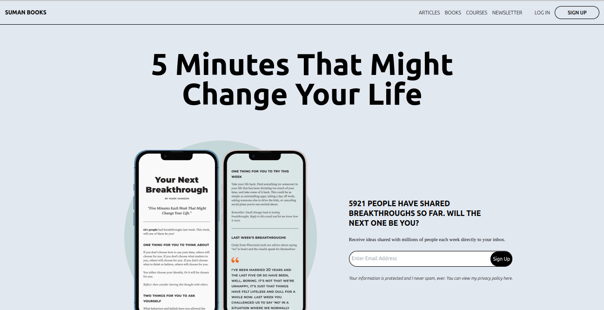
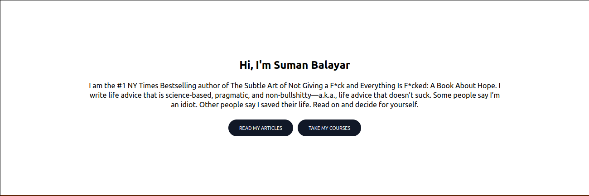
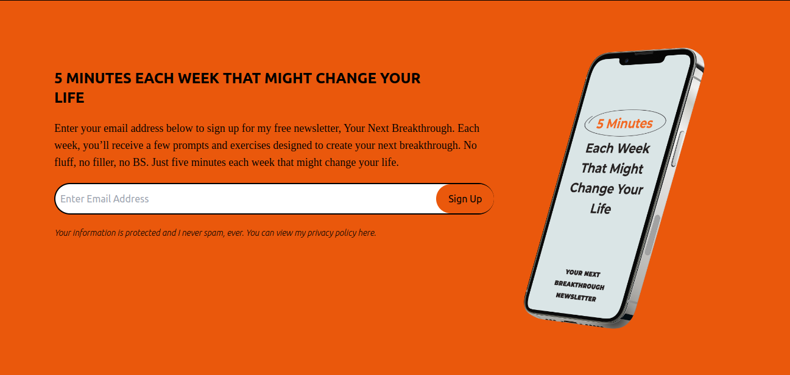
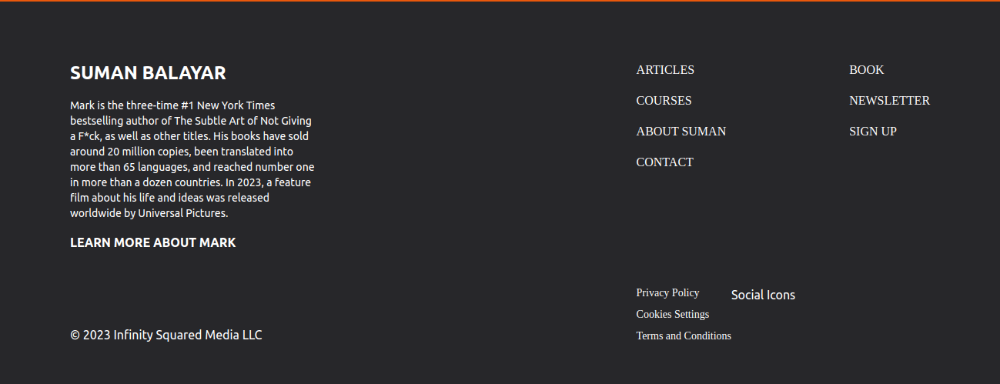

# Project Name

Author Website Design

## Table of Contents

1. [Introduction](#introduction)
2. [Screenshots](#screenshots)
3. [Demo](#demo)
4. [Installation](#installation)
5. [Usage](#usage)
6. [Technologies Used](#technologies-used)
7. [Contributing](#contributing)
8. [License](#license)

## Introduction

This is a frontend design portion of an author website.

## Screenshots

Welcome to my awesome project. Here are some screenshots to give you a glimpse of what it looks like:











## Demo

This is the link to a live demo of this project (if applicable). This is hosted in netlify platform.

[Live Demo](https://coauthor.netlify.app)

## Installation

Here is the detailed process of how you can install this design in your machine.

```bash
# Clone the repository
git clone https://github.com/sumanbalayar08/author_website.git

# Navigate to the project directory
cd author_website

# Install dependencies
npm install

# Start the development server
npm start
